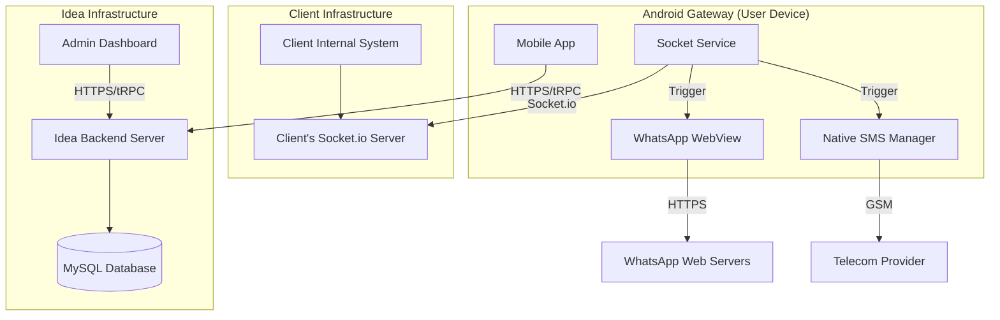

# System Architecture

## Architectural Model
The system operates on a decentralized execution model managed centrally for subscriptions.

### Connectivity Diagram

## Component Details

### 1. Android Application (`/app`)
The core of the solution. It maintains two distinct network connections:
1.  **Management Connection**: Connects to Idea's Backend via tRPC.
    *   **Purpose**: Login, Subscription validation, Usage reporting (billing).
    *   **File Reference**: `lib/trpc.ts`, `hooks/use-auth.ts`.
2.  **Operation Connection**: Connects to the Client's specified Socket.io URL.
    *   **Purpose**: Receiving message payloads directly from the client's system.
    *   **File Reference**: `app/connection-manager.tsx`, `lib/services/socket-service.ts`.

#### WhatsApp Automation Mechanism
*   **File**: `lib/services/whatsapp-service.ts`
*   **Technique**: WebView DOM Injection.
*   **Process**:
    1.  Loads `web.whatsapp.com` in a hidden/visible WebView.
    2.  Waits for the user to scan QR code.
    3.  Injects JavaScript to find the "Message Input" field (e.g., `contenteditable="true"`).
    4.  Simulates typing events and button clicks to send messages.

### 2. Idea Backend Server (`/server`)
*   **Role**: SaaS Management Platform.
*   **Responsibilities**:
    *   User Authentication & Authorization.
    *   Plan & Subscription Management (Stripe).
    *   System-wide Analytics.
*   **Note**: This server **DOES NOT** process the actual message payloads in this architecture. Messages flow directly from Client Server -> App.

### 3. Client Socket Server (External)
*   **Role**: The source of truth for messages.
*   **Responsibility**: The client must host a Socket.io server that emits `send_message` events to the connected Android Gateway.
